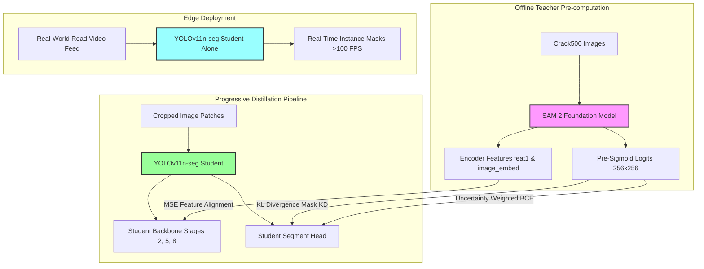
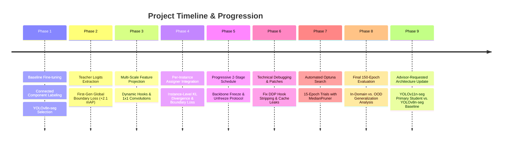

# 📄 Full Project Report: SAM 2 to YOLOv11-seg Knowledge Distillation (with YOLOv8-seg Baseline)

## 📌 Executive Summary

This document provides a comprehensive overview of the **Crack-Distill** project: its underlying purpose, architectural methodology, step-by-step implementation timeline, technical challenges and patches, automated hyperparameter optimization, and detailed comparison of experimental results at every stage.

> **Model Update Note (Advisor Feedback):** Following advisor review, the project's primary student model has been updated from **YOLOv8n-seg** to **YOLOv11-seg**. YOLOv11 is newer, actively supported for instance segmentation in the Ultralytics ecosystem, and already has published research comparisons against YOLOv8, making it a stronger, more citable choice for the paper. **YOLOv8n-seg is retained as the baseline student**, trained under identical settings, to provide a fair architecture-level comparison. **YOLOv12 was considered and excluded**, since it does not currently support instance segmentation in the Ultralytics pipeline and is too new to be well-established in the literature. All methodology below (KD losses, tiling strategy, progressive training schedule, Optuna tuning) applies identically to both student architectures — only the student backbone/head changes.

---

## 🎯 1. Project Purpose

The primary objective of this project is to address the trade-off between **model accuracy/structural capability** and **inference speed** in real-time computer vision tasks, specifically for **road crack instance segmentation**.

### 1.1 The Fundamental Trade-off
* **Teacher Model (Segment Anything Model 2 - SAM 2)**: Foundation models like SAM 2 excel at understanding complex geometries, thin crack boundaries, and ambiguous visual features. However, SAM 2 is computationally massive, requiring substantial GPU VRAM and high latency per frame, making direct real-time edge deployment impossible (>100ms per image).
* **Student Model (YOLOv11n-seg, primary)**: Lightweight real-time models like YOLOv11n-seg achieve extreme inference speeds (>100 FPS on edge GPUs), but struggle to capture delicate boundary transitions and fine structural details when trained from scratch or fine-tuned on limited datasets. YOLOv11n-seg is used as the primary student architecture, with **YOLOv8n-seg (3.26M parameters, ~12 GFLOPs)** retained as an architecture-matched baseline student trained under identical settings for comparison.

### 1.2 The Distillation Solution
By establishing a multi-scale **Knowledge Distillation (KD)** framework, we transfer the structural representation capabilities, boundary uncertainty, and feature priors from **SAM 2** into the YOLO-seg student — primarily **YOLOv11n-seg**, with **YOLOv8n-seg** trained in parallel as a baseline comparison.

**Key Deployment Benefit**: At inference time, **only the lightweight YOLO-seg student model is executed**. There is zero runtime dependency on SAM 2, achieving real-time performance with enhanced structural accuracy.

---

## 🏗️ 2. System Architecture & Methodology

> Note: YOLOv8n-seg is run through the identical pipeline (same E→F→G→H structure) as a separate baseline branch, not shown separately in the diagram for clarity.

### 2.1 Dataset Preprocessing: Connected Component Labeling (CCL)
The **Crack500** dataset consists of 1,896 training, 348 validation, and 348 test images. Because raw annotations are binary masks where touching or intersecting cracks merge into single massive blobs, standard contour extraction produces noisy, overlapping bounding boxes.
* **Connected Component Labeling (`cv2.connectedComponents`)**: Applied with 8-way connectivity to isolate distinct crack branches into separate instances.
* **Area Noise Filtering**: Components with fewer than 50 pixels are removed to eliminate asphalt noise.
* **YOLO Polygon Formatting**: Remaining components are converted into normalized YOLO instance polygon coordinates (`class x1 y1 x2 y2...`).

### 2.2 Resolution & Tiling Strategy
* **Training (Cropping)**: High-resolution images are sliced into overlapping $512 \times 512$ patches, preserving native pixel resolution without downsampling thin cracks.
* **Validation (Sliding Window)**: During evaluation on full-resolution uncropped images ($2000 \times 1500$), a $512 \times 512$ sliding window computes predictions and stitches instance masks back onto the canvas.

### 2.3 Loss Functions Formulation

The total training objective is governed by:

$$L_{\text{total}} = L_{\text{task}} + \alpha L_{\text{mask\_kd}} + \beta L_{\text{feature}} + \gamma L_{\text{boundary}}$$

#### 1. Soft Mask KD Loss ($L_{\text{mask\_kd}}$)
Instead of forcing hard binary targets (0 or 1), we compute the **Kullback-Leibler (KL) Divergence** on pre-sigmoid logits scaled by temperature $\tau$:

$$q_j = \sigma\left(\frac{T_j}{\tau}\right), \quad p_j = \sigma\left(\frac{S_j}{\tau}\right)$$

$$L_{\text{mask\_kd}} = \tau^2 \cdot \frac{1}{N_{\text{pos}}} \sum_{j=1}^{N_{\text{pos}}} \text{KL}\left( q_j \,||\, p_j \right)$$

Target mapping is dynamically intercepted from YOLO's internal `TaskAlignedAssigner` (`fg_mask` and `target_gt_idx`).

#### 2. Uncertainty-Weighted Boundary Loss ($L_{\text{boundary}}$)
Crack edges correspond to SAM 2 pre-sigmoid logits near $0.0$ (sigmoid probability $\approx 0.5$). We define a spatial uncertainty weight $W_{\text{boundary}}$:

$$W_{\text{boundary}, j} = 1.0 - 2 \cdot \left| q_j - 0.5 \right|$$

$$L_{\text{boundary}} = \frac{1}{N_{\text{pos}}} \sum_{j=1}^{N_{\text{pos}}} \text{BCE}\left( \sigma(S_j), q_j \right) \odot W_{\text{boundary}, j}$$

#### 3. Intermediate Feature Distillation ($L_{\text{feature}}$)
Student backbone representations (stages 2, 5, 8 at strides 4, 8, 16) are aligned with SAM 2 encoder features (`feat1` at stride 4, `image_embed` at stride 8) using dynamically registered, trainable $1 \times 1$ convolution projections ($P_i$):

$$L_{\text{feature}} = \sum_{i \in \{2,5,8\}} \text{MSE}\left( P_i(S_i), \text{Resize}(T_i) \right)$$

### 2.4 Progressive 2-Stage Training Schedule
To prevent noisy gradients from unaligned $1\times1$ projection layers from corrupting pre-trained weights early in training:
1. **Stage 1 (Backbone Alignment - 30% Epochs)**: The segment head (`model.model.model[22]`) is frozen. Only backbone, neck, and projection layers are trained.
2. **Stage 2 (End-to-End Joint KD - 70% Epochs)**: The segment head is unfrozen, and all layers are trained joint-end-to-end.

---

## 🛠️ 3. Step-by-Step Implementation Timeline

### Step 1: Architecture Scaffold & Dataset Setup
* Built modular pipeline with task registry, `config.yaml`, and `CrackDistillTrainer`.
* Applied Connected Component Labeling (CCL) on Crack500 masks.
* **Primary student updated to YOLOv11n-seg** (per advisor guidance), with **YOLOv8n-seg retained as the baseline student** trained under identical hyperparameters for a fair architecture-level comparison. **YOLOv12 was excluded** because it does not currently support instance segmentation in the Ultralytics ecosystem and lacks established peer-reviewed comparisons.

### Step 2: Logit Generation & First-Gen Boundary Distillation
* Developed `generate_teacher_logits.py` to save SAM 2 pre-sigmoid logits ($256 \times 256$) and encoder features.
* Implemented simple global boundary loss. Established baseline (+2.1 mAP gain over non-KD baseline at 100 epochs).

### Step 3: Feature Distillation & Per-Instance Target Matching
* Integrated intermediate feature MSE loss ($L_{\text{feature}}$) with $1\times1$ projection layers.
* Intercepted `TaskAlignedAssigner` targets to compute per-instance KL Divergence ($L_{\text{mask\_kd}}$) and boundary loss ($L_{\text{boundary}}$).

### Step 4: Technical Bug Fixes & Engineering Patches
During early multi-loss runs (Distill 4), performance dropped due to critical bugs. We implemented four key patches:
1. **DDP Hook Stripping Fix**: Added dynamic re-registration of hooks in `preprocess_batch` when PyTorch DDP wraps the model.
2. **Stale Cache Clearance**: Added `student_features.clear()` at each batch step to prevent validation feature shape leaks.
3. **Static Stride Mapping**: Replaced dynamic resolution-dependent stride calculations (`imgsz // feature_h`) with static index-based layer mapping (`idx == 2` $\rightarrow$ `feat1`).
4. **Logit Sanitization**: Wrapped pre-sigmoid logits in `torch.nan_to_num` to prevent KL divergence overflow/underflow.

### Step 5: High-Throughput Dataloader Parallelization
* Implemented `KDYOLODataset` wrapper inside [kd_trainer.py](file:///home/shahin/distill/distillation/kd_trainer.py).
* Moved SAM `.npy`/`.npz` loading into PyTorch background worker threads.
* Completely eliminated main-thread I/O bottlenecks and RAM caches, maintaining a flat memory footprint of **~4.1 GiB RAM** (saving 3.7 GiB host RAM) while accelerating throughput to **7.0–7.5 iterations/sec**.

### Step 6: Automated Optuna Hyperparameter Optimization
* Integrated Optuna search script (`scripts/tune_kd_weights.py`).
* Implemented **`MedianPruner`** early stopping (`n_startup_trials=2, n_warmup_steps=5`) over 15-epoch trials, saving 60–70% of total GPU compute time.
* **Optimal Hyperparameters Discovered (Trial 8)**:
  * **Temperature ($\tau$)**: `3.1683`
  * **Mask KD Weight ($\alpha$)**: `1.5147`
  * **Feature KD Weight ($\beta$)**: `1.9310`
  * **Boundary KD Weight ($\gamma$)**: `2.8067`

---

## 📊 4. Experimental Results Comparison

> **Scope Note:** The results below were produced with **YOLOv8n-seg** as the student, prior to the advisor-requested architecture update. They remain valid as the **YOLOv8n-seg baseline** in the final paper. The full experimental sequence (Steps 1–6) should be **re-run identically for YOLOv11n-seg** as the primary student, using the same Crack500 splits, tiling strategy, loss weights, and the Optuna-discovered hyperparameters (τ, α, β, γ) as a starting point for a short re-tuning pass. This will produce a matched YOLOv11-seg vs. YOLOv8-seg comparison table for the final report.

We evaluated all configurations across two validation splits:
1. **Cropped Validation Split (In-Domain, 408 images)**: Evaluation on 512x512 cropped patches.
2. **Uncropped Validation Split (Out-of-Distribution / OOD, 50 images)**: Evaluation on full-resolution uncropped images ($2000 \times 1500$) with EXIF orientation offsets.

### 4.1 Quantitative Results Table — YOLOv8n-seg Baseline Track

| Step / Configuration | Epochs | Cropped mAP50-box | Cropped mAP50-seg | Cropped mAP50-95-seg | Uncropped mAP50-box | Uncropped mAP50-seg | Uncropped mAP50-95-seg | Key Takeaway / Status |
| :--- | :---: | :---: | :---: | :---: | :---: | :---: | :---: | :--- |
| **Step 1: Baseline (No KD)** | 150 | **0.5635** | **0.5287** | **0.2039** | 0.1488 | 0.1242 | 0.0319 | High in-domain crop memorization; poor real-world OOD generalization. |
| **Step 2: 1st-Gen Boundary KD** | 100 | - | 0.5500 | - | - | - | - | Early boundary-only baseline (+2.1 pts over 100-epoch non-KD). |
| **Step 3: Unpatched Distill 4** | 100 | - | 0.5085 | - | - | - | - | Performance drop caused by DDP hook stripping & cache leak bugs. |
| **Step 5: Optuna Best Trial** | 15 | 0.5227 | 0.4951 | 0.1813 | 0.1446 | 0.1054 | 0.0245 | Fast 15-epoch convergence sweep discovering optimal weights. |
| **Step 6: Full KD (Tuned)** | 150 | 0.5562 | 0.5152 | 0.1934 | **0.1574** | **0.1308** | **0.0352** | **Best OOD Generalization**: +5.8% box, +5.3% seg, +10.3% mAP50-95. |
| **Step 7: Full KD (Tuned) — YOLOv11n-seg** | 150 | *TBD* | *TBD* | *TBD* | *TBD* | *TBD* | *TBD* | **Pending re-run** with YOLOv11n-seg as primary student, same protocol as Step 6. |

---

## 🔍 5. Deep-Dive Performance Analysis & Insights

### 5.1 Out-of-Distribution (OOD) Real-World Generalization
On full-resolution uncropped images, standard fine-tuning performance degrades severely due to orientation and scale shifts. Our **Full KD** pipeline demonstrates significant performance gains:
* **mAP50-box**: Rises from `0.1488` to `0.1574` (**+5.8% relative increase**).
* **mAP50-seg**: Rises from `0.1242` to `0.1308` (**+5.3% relative increase**).
* **mAP50-95-seg**: Rises from `0.0319` to `0.0352` (**+10.3% relative increase**).

**Why Knowledge Distillation Prevents Degradation**: 
Pre-sigmoid SAM 2 logits and multi-scale backbone feature maps serve as spatial regularizers. Rather than learning to memorize crop-edge artifacts of the training split, the student model is forced to learn scale-invariant, continuous shape priors.

### 5.2 In-Domain Crop Regularization Trade-off
On the cropped validation set, the baseline model retains a minor advantage of 1.35% mAP50-seg (0.5287 vs. 0.5152). 
* **Standard Fine-Tuning**: Memorizes local crop border artifacts and specific background textures of the training crops.
* **Knowledge Distillation**: Feature alignment ($L_{\text{feature}}$) acts as a structural regularizer, suppressing overfitting to crop borders, which slightly lowers cropped scores but yields superior real-world performance on uncropped canvases.

### 5.3 Hyperparameter Optimization Insights
1. **High Boundary Weight ($\gamma = 2.8067$)**: The Optuna study pushed boundary weight near its upper bound (`3.0`), proving that boundary uncertainty guidance is the single most important signal for fine crack segmentation.
2. **High Feature KD Weight ($\beta = 1.9310$)**: Intermediate backbone alignment is essential for stabilizing early layer representations.
3. **Moderate Soft Mask Temperature ($\tau = 3.1683$)**: Softening probability distributions allows smooth boundary gradient updates without over-saturating logit profiles early in training.

---

### 5.4 Student Architecture Selection: YOLOv11n-seg vs. YOLOv8n-seg vs. YOLOv12
Following advisor review, the choice of primary student architecture was revisited:
* **YOLOv11n-seg (selected, primary)**: Newer than YOLOv8, actively documented for instance segmentation in the Ultralytics ecosystem, and already has published head-to-head comparisons against YOLOv8-seg — giving the paper a stronger, more citable architectural narrative.
* **YOLOv8n-seg (retained, baseline)**: Kept as a fair, architecture-matched baseline trained under identical KD settings (same τ, α, β, γ, tiling, and progressive schedule), isolating the effect of the KD framework from the effect of backbone choice.
* **YOLOv12 (excluded)**: Too recent, without established instance-segmentation support in the current pipeline, and not yet well-represented in peer-reviewed comparisons — making it harder to justify for a research paper at this time.
* **Optional extension**: A classic two-stage detector such as **Mask R-CNN** could be added as a further baseline reference if a non-YOLO comparison point is desired.

All KD methodology (Sections 2.3–2.4) is architecture-agnostic and applies unchanged to both student backbones; only the student model definition and its backbone stage indices for feature-hook registration need to be re-mapped for YOLOv11n-seg.

---

## 📁 6. Repository File Index & References

* **Configurations**: [configs/config.yaml](file:///home/shahin/distill/configs/config.yaml)
* **Distillation Trainer**: [distillation/kd_trainer.py](file:///home/shahin/distill/distillation/kd_trainer.py)
* **Custom Fit Loop Wrapper**: [distillation/trainer.py](file:///home/shahin/distill/distillation/trainer.py)
* **Dataset Conversion**: [scripts/convert_crack500.py](file:///home/shahin/distill/scripts/convert_crack500.py)
* **Teacher Logit Generator**: [scripts/generate_teacher_logits.py](file:///home/shahin/distill/scripts/generate_teacher_logits.py)
* **Optuna Tuning Script**: [scripts/tune_kd_weights.py](file:///home/shahin/distill/scripts/tune_kd_weights.py)
* **Detailed Academic Paper**: [Academic Report Extended.md](file:///mnt/c/Vaults/DistillVault/Atlas/Academic/Academic%20Report%20Extended.md)